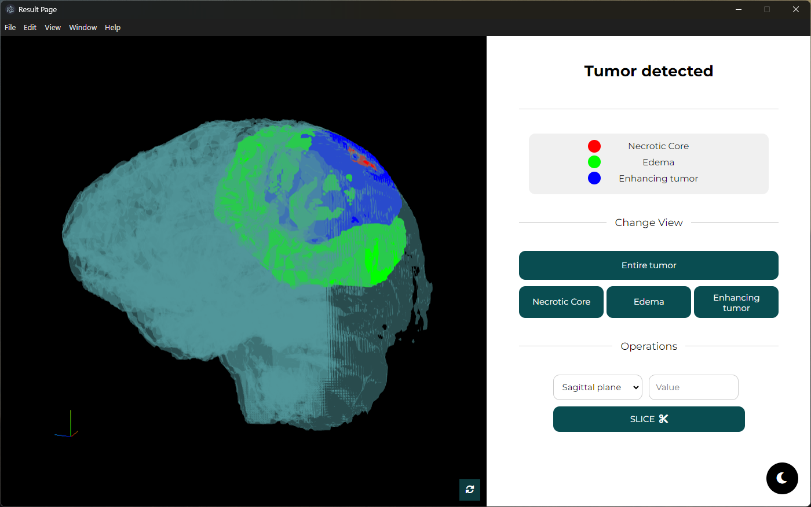

# Brain-Tumor-Segmentation
Hi to everyone!

The project focuses on developing an advanced system for 3D brain tumor segmentation and visualization using convolutional neural networks and 3d libraries. The primary goal is to provide an effective and accessible tool for biomedical image visualization and analysis, aimed at supporting doctors and researchers in diagnosis and treatment planning. The system enables the generation of detailed 3D models, enhancing accuracy and effectiveness in identifying tumor regions.
The project focuses on developing an advanced system for 3D brain tumor segmentation and visualization using convolutional neural networks and 3D libraries. The primary goal is to provide an effective and accessible tool for biomedical image visualization and analysis, aimed at supporting doctors and researchers in diagnosis and treatment planning. The system enables the generation of detailed 3D models, enhancing accuracy and effectiveness in identifying tumor regions.

The project was developed for the thesis of my Computer Science bachelor.

To run the project you have to locate your terminal in 	`Brain-Tumor-Segmentation\GUI` and then launch `npm run`.

You can install all the librarires using the `requirements.txt` file and also the libraries from `package-lock.json`.

> It's important that you install all the libraries, different version of the libraries are not tested.

## How it work?
The project accept in input only a dir that contains 3 mri scan (T1-weighted, T2, Flair), like the Brats dataset. After you have waited a certain amount of time, that depends by your machine, you can study and have a 3D overview of the brain within the tumor segmented in 3 different regions. It is also possible to have an overview in a separate way of each regions or cut the model in various way to have a look from the inside. 

See the video:

